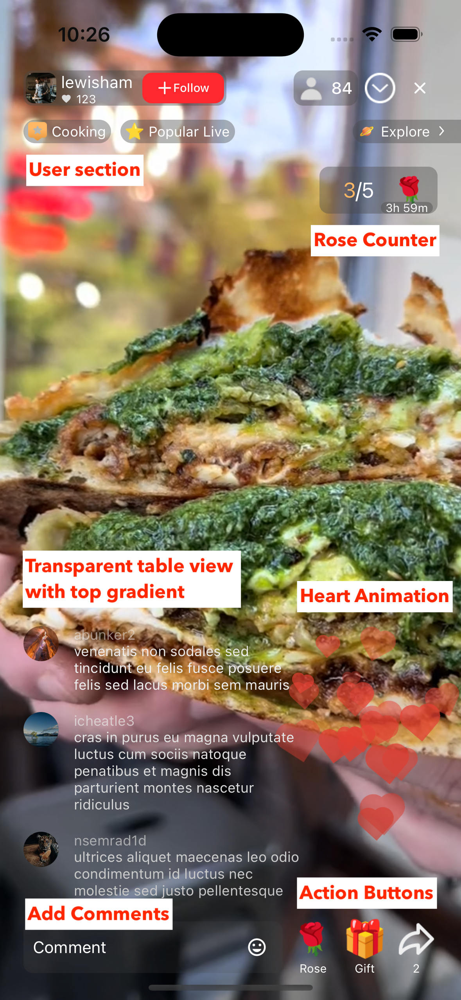
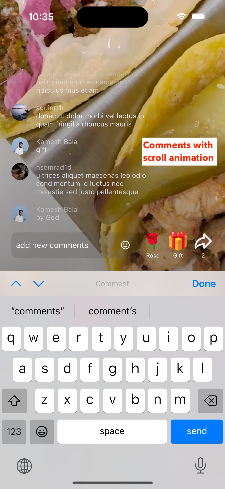
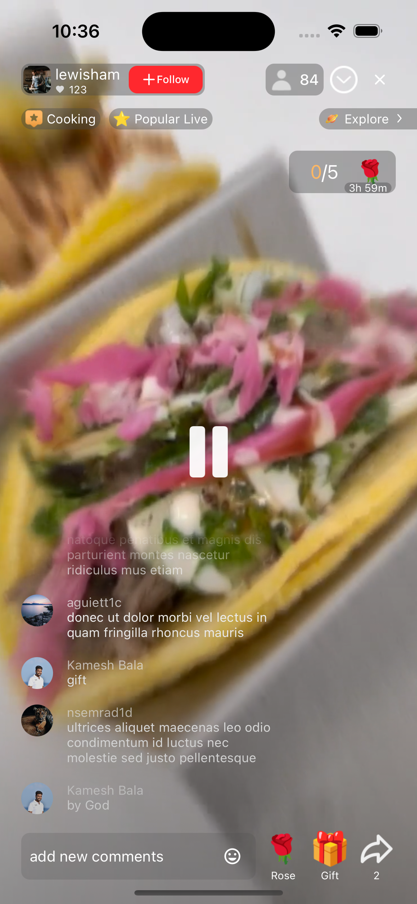

# LIVEr Shorts Sample Project

## Overview
You can view the full video playback by [downloading it here](LIVEr_compressed.mp4).

## Features
### 1. Fullscreen CollectionView with Video Player

- **Fullscreen Cells**:
  - Each `UICollectionViewCell` occupies the entire screen, ensuring only one cell is visible at a time.
- **Paginated Navigation**:
  - Swipe up or down to navigate between videos.
- **Video Playback**:
  - Automatically plays video on cell load.
  - Videos loop seamlessly.
  - Supports play/pause functionality on a single tap.
- **User Section**:
  - Displays **username**, **profile picture**, **viewers**, and **likes** over the video player.
- **Rose Counter**:
  - Displays the number of roses sent by users.
  - Updates dynamically with animation using a `didSet` property.
- **Post, Gift, and Rose Actions**:
  - Single-tap gestures trigger custom actions (e.g., incrementing counters or displaying feedback).

### 2. Transparent TableView for Comments

- **Mock Comments**:
  - Comments load dynamically after the video starts.
  - New comments scroll into view every 2 seconds.
- **Design**:
  - Transparent background.
  - **White text** for comments.
  - **Gray text** for usernames.
- **Gradient Effect**:
  - The topmost comment is masked with a gradient, fading to transparent for smooth visual blending.
- **Add Comment**:
  - Tap the comment text field to bring up the keyboard.
  - UI shifts upward dynamically using **IQKeyboardManager Swift**.
  - After posting, the new comment animates into the scrolling table view.

### 3. Double Tap Heart Animation
You can view the heart animation by [downloading it here](Heart_animation.mp4).

- **Heart Animation**:
  - Double-tap anywhere on the video player to trigger a floating heart animation.
  - Hearts float upward with varying opacity, size, and trajectories.
  - Implemented using **CoreAnimation**.

### 4. Other Features
- **Looping Video Playback**:
  - Videos loop automatically when they reach the end.
- **SDWebImage Integration**:
  - Efficiently handles image caching and asynchronous loading for profile pictures.
- **Play/Pause on Tap**:
  
  
  - Single-tap gesture toggles playback state with an optional play/pause icon animation.
---

## Third-Party Libraries

### 1. **IQKeyboardManager Swift**
- Handles keyboard interactions to ensure a smooth user experience when adding comments.

### 2. **SDWebImage**
- Optimized image loading and caching for user profile pictures.

---

## How It Works

### 1. **Videos**
- The JSON file is parsed to fetch video data.
- Videos are loaded into a paginated `UICollectionView`.

### 2. **Comments**
- The JSON file is parsed to fetch comments.
- Mock comments are generated dynamically for each video.
- Comments appear in a transparent table view and scroll up every 2 seconds.

### 3. **Interactive Gestures**
- **Single Tap**: Toggles video pause or play.
- **Double Tap**: Displays a floating heart animation.

### 4. **Gradient Mask**
- The topmost comment in the table view fades into a gradient for a clean visual effect.

### 5. **Action Buttons**
- Handles interactive gestures for "Post," "Gift," and "Rose" actions.

---

## Future Improvements

- API integration & showing live data.
- Implement additional video controls like volume adjustment and seek bar.
- Video seek bar to show video length.
- Prefetch video data for fast loading.
- Mute or unmute functionality.
- Hide or show comments tableview.

---

## Portfolio and Social Links

- **Portfolio**: [http://kameshwaran.com](http://kameshwaran.com)
- **LinkedIn**: [https://www.linkedin.com/in/kamesh-bala-278187143/](https://www.linkedin.com/in/kamesh-bala-278187143/)
